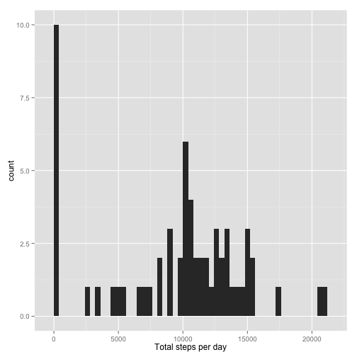
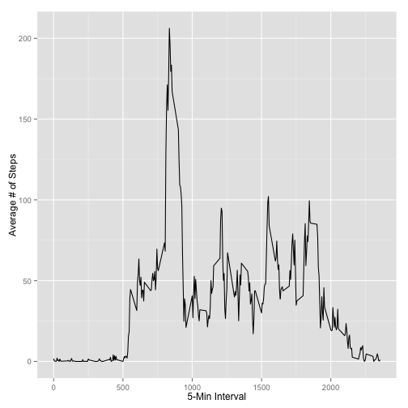
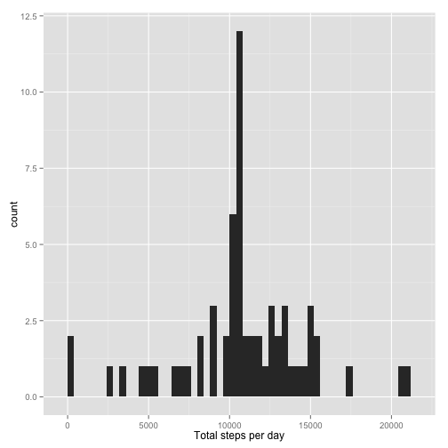

Lets load the data 

```r
my.dataset <- read.csv("activity.csv")
```

First section of questions.  
1. What is mean total number of steps taken per day?  
2. Calculate the total number of steps taken per day  
3. Make a histogram of the total number of steps taken each day  
4. Calculate and report the mean and median of the total number of steps taken per day  

```r
total.steps <- tapply(my.dataset$steps, my.dataset$date, sum, na.rm="TRUE")
library(ggplot2)
qplot(total.steps, binwidth=400, xlab="Total steps per day")
```

 

```r
mean(total.steps, na.rm="TRUE")
```

```
## [1] 9354.23
```

```r
median(total.steps, na.rm="TRUE")
```

```
## [1] 10395
```

Second set of questions  
1. What is the average daily activity pattern?  
2. Make a time series plot (i.e. type = "l") of the 5-minute interval (x-axis) and the average number of steps taken, averaged across all days (y-axis)  
3. Which 5-minute interval, on average across all the days in the dataset, contains the maximum number of steps?  

```r
my.average <- aggregate(x=list(steps=my.dataset$steps), by=list(interval=my.dataset$interval), mean, na.rm="TRUE")
ggplot(data=my.average, aes(x=interval, y=steps)) + geom_line() + xlab("5-Min Interval") + ylab("Average # of Steps")
```

 

```r
my.average[which.max(my.average$steps),,]
```

```
##     interval    steps
## 104      835 206.1698
```

3rd set of questions   
Imputing missing values  
Note that there are a number of days/intervals where there are missing values (coded as NA). The presence of missing days may introduce bias into some calculations or summaries of the data.  

1. Calculate and report the total number of missing values in the dataset (i.e. the total number of rows with NAs)  
2. Devise a strategy for filling in all of the missing values in the dataset. The strategy does not need to be sophisticated. For example, you could use the mean/median for that day, or the mean for that 5-minute interval, etc.  
3. Create a new dataset that is equal to the original dataset but with the missing data filled in.  
4. Make a histogram of the total number of steps taken each day and Calculate and report the mean and median total number of steps taken per day. Do these values differ from the estimates from the first part of the assignment? What is the impact of imputing missing data on the estimates of the total daily number of steps?  

```r
missing.values.mask <- is.na(my.dataset$steps)
sum(missing.values.mask)
```

```
## [1] 2304
```

```r
new.data <- my.dataset
new.data$steps[is.na(new.data$steps)] = mean(my.average$steps, na.rm=TRUE)

total.new.steps <- tapply(new.data$steps, new.data$date, sum, na.rm="TRUE")

qplot(total.new.steps, binwidth=400, xlab="Total steps per day")
```

 

```r
mean(total.new.steps, na.rm="TRUE")
```

```
## [1] 10766.19
```

```r
median(total.new.steps, na.rm="TRUE")
```

```
## [1] 10766.19
```
Both the mean and median have higher values.  With the original dataset, values with NA are no included in any averaging method, as they are excluded.  When you fill in these NA's with any value greater than zero, it will skew the resultan. 

Last Question not completed.  


